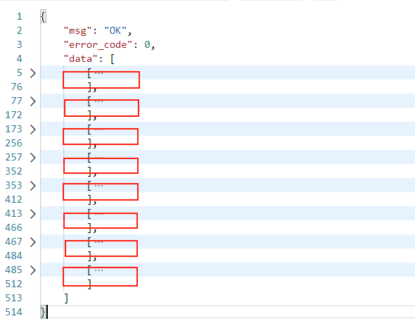

### 功能描述

用户通过输入自己的账号和密码，来查询自己教务系统中的成绩

### 请求说明

> 请求方式：POST  请求URL ：v1/grades/getgrades

### 请求参数

| 字段           | 字段类型 | 字段说明     |
| :------------- | :------- | :----------- |
| openid(HEADER) | String   | 用户的openid |
| username       | String   | 教务系统账户 |
| password       | String   | 教务系统密码 |

### 返回结果

200 : OK  请求成功，返回token

```json
{
    "msg": "OK",
    "error_code": 0,
    "data": [
        [
            {
                "Course_Name": "大学英语口语",
                "Course_Credit": 1,
                "Course_Grade": 95,
                "Course_Grade_Point": 4.5
            },
            {
                "Course_Name": "C语言程序设计",
                "Course_Credit": 3.5,
                "Course_Grade": 81,
                "Course_Grade_Point": 3.1
            },
            
            .....
            
            {
                "Course_Name": "学期平均绩点",
                "Course_Grade_Point": 4.21
            },
            {
                "Course_Name": "总平均绩点",
                "Course_Grade_Point": 3.38
            }
        ]
    ]
}
```

data数据中，按照学期划分，如图所示有8个学期的成绩，但是有的低年级同学学期并非是8个学期



200 : OK     code: -3 密码错误

```json
{
    "msg": "账号或密码错误",
    "error_code": -3,
    "data": []
}
```

400 : Bad Request    

```json
{
    "msg": [
        "username字段是必填参数",
        "password字段是必填参数"
    ],
    "error_code": 10001,
    "request": "POST /v1/grades/getgrades"
}
```

### 返回参数

| 字段               | 字段类型 | 字段说明 |
| :----------------- | :------- | :------- |
| Course_Name        | String   | 课程名称 |
| Course_Credit      | Integer  | 课程学分 |
| Course_Grade       | Integer  | 课程成绩 |
| Course_Grade_Point | Integer  | 课程绩点 |

### 错误状态码

| 状态码 | 说明                             |
| :----- | :------------------------------- |
| 10006  | 账号或密码错误，无法登陆教务系统 |

